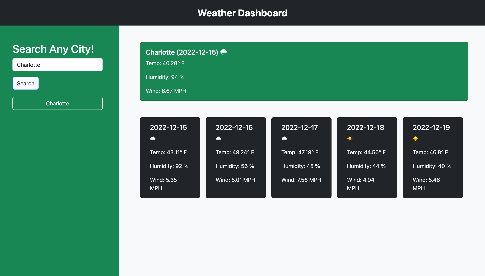
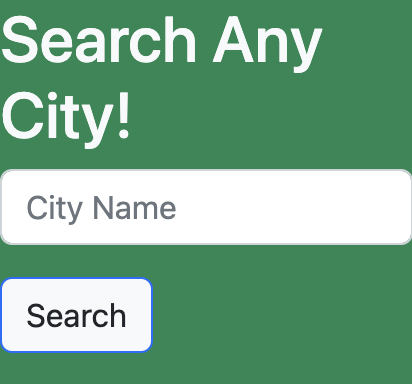
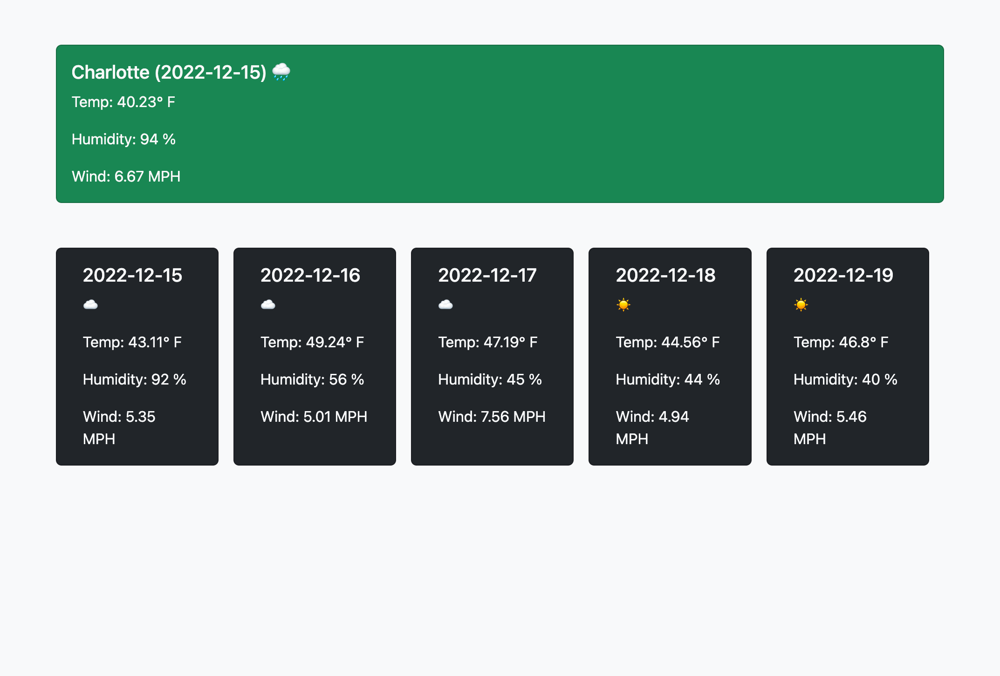
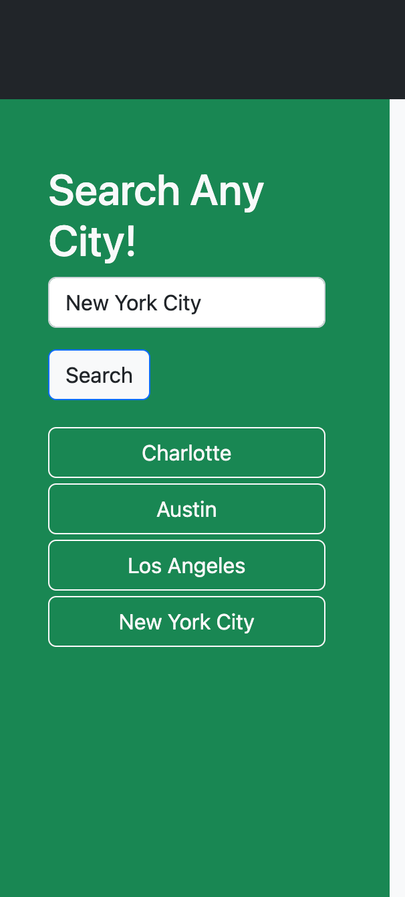

# Weather Dashboard

[Link to my project](https://ryan-young17.github.io/weather-forecast/)

## Table of Contents
- [Description](#Description)
- [Visuals](#Visuals)
- [Usage](#Usage)

## Description

The Weather Dashboard application is created so a user can input any major city in the search form and receive that city's current weather, as well as the future five-day forecast. The weather results include the date, temperature, humidity, wind, and also shows an icon for the overall weather that day (i.e. sunshine icon, cloud icon, or a rain cloud icon). Once a city has been searched, it is saved and appended to the page as a button they can use to retrieve the weather data again.

## Visuals

## Usage

The Weather Dashboard application allows you to input any city in the search bar on the left aside, and it will return the current day's weather, as well as the future five-day forecast. In order to use, follow these instructions:

- Input the city name in the search bar on the left aside and click the "Search" button below it.

- Once clicked, results should appear on the page, as well as a button of the searched city in the aside:

- If you continue to search new cities, your past searches should appear in the aside as buttons:

- You are then able to click on any of the buttons of the past searches to return the current weather data of that particular city.